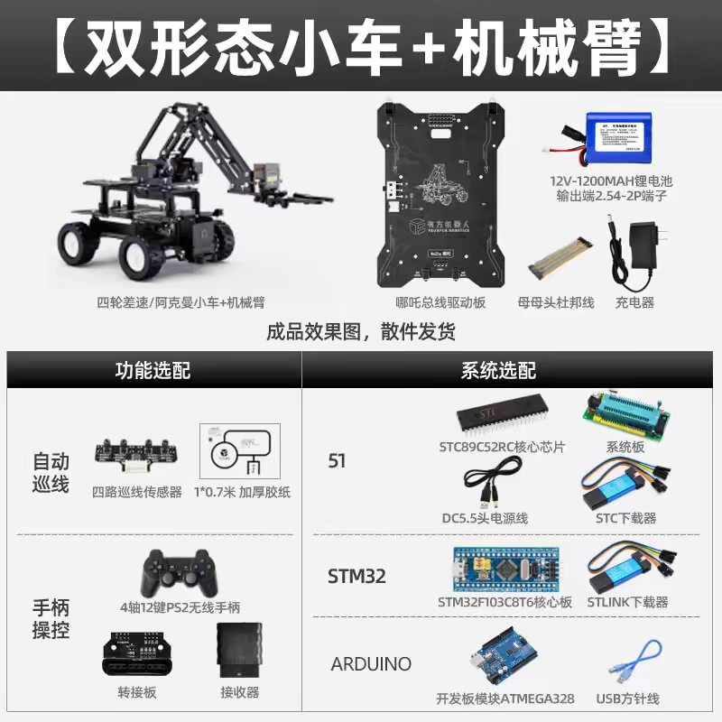

# 视觉控制小车 · Vision-Sense Car

一套 **AI 视觉 + 手机遥控 + 嵌入式运动控制** 的智能小车工程：摄像头采集画面，大脑板解析目标并生成控制指令，通过 UART 帧协议指挥执行板驱动「阿克曼底盘 + 机械臂」，手机 App 负责图传、操控与 AI 目标下发。

```
手机 App ──BLE 配网 / WiFi 图传+指令──▶ 视觉大脑板(ESP32-S3) ──UART 帧──▶ 执行板(STM32) ──▶ 电机/舵机
                                                                    ◀── 状态帧(里程/到位) ──┘
```

> 当前为**开发进行中**版本：BLE 配网、WS 图传、UART 帧链路已接通可跑；「多模态 AI 视觉控制」链路（`ai_goal`）为桩，尚待接入云端大模型。

---

## 1. 功能特性

- 📷 **实时图传**：WiFi WebSocket 推送 JPEG 帧，App 内查看画面（并可框选/标注目标）。
- 🎮 **遥控操控**：虚拟摇杆 + 指令面板，阿克曼小车直行/转向、机械臂升降/移爪/夹爪。
- 🤖 **速度闭环 / 到位判定**：执行板按编码器做轮速 PID 与里程计，支持「直行 N cm / 转向 N°」类定距指令。
- 📶 **BLE 一次性配网**：App 扫描到广播名 `VisionS3` 后写入 WiFi 账号，板子 NVS 存储、重启生效。
- 🧠 **AI 视觉控制（规划中）**：手机下发文字/区域目标 → 云端多模态模型 → 指令 → 执行（当前为桩，预留接口）。

## 2. 系统架构

整体角色与通信链路如下（详见各子工程 README/CLAUDE.md）：

```
┌────────────────────┐    ① BLE 配网 / 兜底控制（GATT，广播名 VisionS3）
│  手机 App           │ ◀───────────────────────────────────────┐
│ Mobile-RemoteCtrl  │   ② WiFi WebSocket（端口 81）：           │
│  (Godot / Android) │      图传 JPEG（二进制）+ 指令 JSON（文本）│
└────────────────────┘ ◀───────────────────────────────────────▶│
                                                                 ▼
┌──────────────────────────┐         ┌──────────────────────────────────┐
│  云端多模态 AI（规划中）    │ ③目标     │ 视觉/控制大脑板 Stm32-Vision      │
│  DeepSeek V4 Flash(桩)   │ ai_goal  │ ESP32-S3-CAM(N16R8, OV2640)      │
│                          │ ────────▶│ 词表→UART帧翻译 · WS/命令分发      │
└──────────────────────────┘         └────────────────┬─────────────────┘
                                                      ④ UART 帧 115200
                                               AA 55 LEN DEV CMD [PAYLOAD] CRC16
                                                       ▼
                              ┌──────────────────────────────────────────┐
                              │ 执行板 Stm32-Executor                     │
                              │ STM32F103C8T6 · 5ms 主调度                 │
                              │ 阿克曼底盘(电机+编码器+转向舵机)              │
                              │ 机械臂(3×舵机) · 哪吒扩展板(软I2C)驱动       │
                              └──────────────────────────────────────────┘
```

| # | 链路 | 说明 |
|---|---|---|
| ① | BLE | 手机 → 大脑板：一次性配网（WiFi SSID/密码、AI 接口参数）+ 兜底控制。连接后让出 2.4G 射频，断线自动恢复 |
| ② | WiFi WebSocket | 大脑板 ⇄ 手机：JPEG 图传上行 + 指令 JSON（`move/stop/arm/snapshot/...`）下行 |
| ③ | 云端 AI | 手机 → 模型：文字/区域目标（`ai_goal`）。当前为桩，接口已预留 |
| ④ | UART 帧 | 大脑板 → 执行板：`AA 55 LEN DEV CMD [PAYLOAD] CRC16` 定长帧；执行板周期回传 `0x0A` 状态帧 |

> 词表 JSON（`CommandProto`）只由手机 App 持有；「词表 → UART 帧」的翻译在大脑板 `uart` 模块；执行板只认帧、不回解析 JSON。

<!-- 可选配图：系统接线 / 实物连接示意图 → 存成 docs/img/build/wiring-diagram.png 即可在下方显示 -->
<p align="center"></p>
<p align="center"><sub>▲ 系统接线/整体示意图（把图存到 <code>docs/img/build/wiring-diagram.png</code> 即替换占位）</sub></p>

### 软件构成

| 仓库目录 | 角色 | 语言 / 工具链 | 说明 |
|---|---|---|---|
| [`Stm32-Vision/`](Stm32-Vision/CLAUDE.md) | 视觉/控制大脑板 | C++ · Arduino IDE / arduino-cli（esp32 core 3.3.x） | 摄像头抓帧、WS 图传、BLE 配网、词表→帧翻译、AI 调用预留 |
| [`Stm32-Executor/`](Stm32-Executor/CLAUDE.md) | 执行板固件 | C · Keil MDK（STM32F10x 标准库） | 帧协议译码、阿克曼运动/速度闭环、里程计、机械臂步进、状态上报 |
| [`Mobile-RemoteCtrl/`](Mobile-RemoteCtrl/CLAUDE.md) | 手机遥控 App | GDScript · Godot 4.7.1 mono（Android） | 三通道通信、虚拟摇杆、图传显示、图片标注、BLE 配网界面 |

## 3. 硬件选型（BOM）

> 下表为当前固件所面向的硬件清单。标注「待补充」处请按实物回填型号/数量，并把商品页截图放入对应图片位（见 [3.2](#32-硬件配图)）。
>
> ⚠️ 机械/电气细节（电机数量、舵机型号、供电电压、电池）以你的实际装配为准——下表给出的代码内连接关系（哪吒板 Servo1=转向、Servo2/3/4=机械臂等）是可靠的。

### 3.1 部件清单

| 分类 | 部件 | 选型 / 规格 | 数量 | 作用与接入 |
|---|---|---|---|---|
| 计算视觉 | 视觉大脑板 | **ESP32-S3-CAM（N16R8）**：ESP32-S3 + 16MB Flash + 8MB PSRAM，板载 **OV2640** 摄像头 | 1 | 摄像/图传/配网/指令分发；`camera.h` 顶部 `CAMERA_MODEL_ESP32S3_EYE` |
| 运动执行 | 执行板 MCU | **STM32F103C8T6** 核心板（Blue Pill 类最小系统） | 1 | 5ms 主调度、帧协议译码、电机/舵机驱动、编码器里程计 |
| 运动执行 | 电机驱动扩展 | **哪吒扩展板**（软 I2C 从机） | 1 | 4 路电机 PWM + 4 路编码器回读 + 4 路舵机 PWM + 灯带 |
| 执行机构 | 小车底盘 | 阿克曼转向底盘（前轮舵机转向、后轮驱动） | 1 | `Vehicle_Chassis` + 转向舵机 |
| 执行机构 | 驱动电机 | 带编码器直流减速电机 | 待补充 | 哪吒板 Motor1–4 / Enc1–4 |
| 执行机构 | 转向舵机 | 待补充（代码量程中 150 / 左 120 / 右 190 PWM） | 1 | 哪吒板 **Servo1**（`AckermannDrive`） |
| 执行机构 | 机械臂舵机 | 待补充 | 3 | 哪吒板 **Servo2 移爪 / Servo3 夹爪 / Servo4 抬落**（`RobotArm`） |
| 执行机构 | 机械臂结构 | 小型 3 自由度机械臂套件 | 1 | 与上三舵机组合 |
| 供电 | 电池组 | 待补充（电压取决于电机/舵机规格） | 待补充 | 底盘动力与逻辑电源分配 |
| 调试 | ST-Link | ST-Link/V2 等 | 1 | 烧录 STM32（`stlink-1.8.0-win32/` 已随仓库提供命令行工具） |
| 调试 | USB-TTL | CH340 类串口模块 | 1 | 接执行板 USART1 读状态帧 / 联调标定 |
| 调试 | 数据线 | USB-A/Micro 等 | 1 | 烧录 / 调试 ESP32-S3 |
| 可选 | 手柄 | PS2 无线手柄 + 接收器 | — | 执行板 `PS2_SELFTEST` 直驱自测（不接大脑板时用） |

### 3.2 硬件配图
整体成品见 [第 4 节成品照](#4-成品实拍预留)。

<!-- ============ 视觉大脑板 ============ -->
**① 视觉大脑板 ESP32-S3-CAM**
<p align="center"></p>

<!-- ============ 执行板 ============ -->
**② 执行板 STM32F103C8T6**
<p align="center"></p>

> 目录 `docs/img/hardware/` 里还放了 `README.md` 作为「放图清单」，可勾选完成状态；不需要的图直接删掉对应小节即可。

## 4. 成品实拍（预留）

把整车/细节照片以对应文件名存入 `docs/img/build/` 即替换占位。

<!-- 整车正面 -->
**整车正面**（`docs/img/build/car-front.png`）
<p align="center"></p>

<!-- 整车侧面 -->
**整车侧面**（`docs/img/build/car-side.png`）
<p align="center"></p>

<!-- 内部走线 -->
**内部走线 / 板载布置**（`docs/img/build/car-internal.png`）
<p align="center"></p>

<!-- 动作演示 -->
**动作演示（抓取 / 巡线）**（`docs/img/build/car-action.png`）
<p align="center"></p>

<!-- App 截图 -->
**App 界面（遥控 / 图传）**（`docs/img/build/app-screenshot.png`）
<p align="center"></p>


*主要面向本人维护迭代的工程文档；各子目录由各自仓库独立演进，本仓库为统一收纳视图。*
