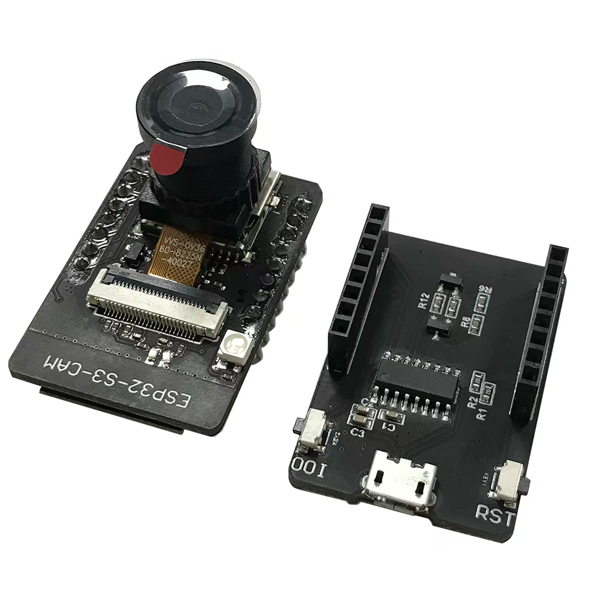

# 视觉控制小车 · Vision-Sense Car

一套 **AI 视觉 + 手机遥控 + 直驱运动控制** 的智能小车工程：ESP32-S3-CAM 采集画面，板载直调云端多模态模型解析目标并生成控制指令，经软件 I2C **直接驱动**哪吒扩展板的电机与舵机，手机 App 负责图传、操控与 AI 目标下发。

```
手机 App ──BLE 配网 / WiFi 图传+指令──▶ 视觉大脑板(ESP32-S3) ──软件 I2C──▶ 哪吒扩展板 ──▶ 电机/舵机/灯
        ◀──────────── WS 状态 / exec_status 上行 ────────────────┘
```

> 当前为**开发进行中**版本：BLE 配网、WS 指令/状态、UDP 图传、软件 I2C 直驱（四轮电机 / 四个舵机 / 三路灯光）均已接通可跑；板载 DIRECT AI（`ai_goal`）已实现，任务级闭环真机联调中。
>
> ⚠️ 本项目**已取消独立的 STM32 执行板**（原 `Stm32-Executor/`，因硬件问题裁撤），改由视觉板直驱。旧的 UART 帧协议与双板架构只存在于 git 历史。

---

## 1. 功能特性

- 📷 **实时图传**：WiFi UDP 推流 JPEG 帧（低延迟、分片自愈），App 内查看画面并框选/标注目标。
- 🎮 **遥控操控**：虚拟摇杆 + 指令面板，小车前进/后退/转向、机械臂升降/移爪/夹爪、三路灯光开关、一键回正。
- 🧠 **板载 AI 视觉控制**：手机下发文字/区域目标 → 板子直调云端多模态模型 → 指令 → **直驱落地**（任务级迭代闭环，`ai_goal` / `ai_oneshot`）。
- 🦾 **机械臂二连杆 IK**：给末端目标位姿（轴前方 cm + 地面以上 cm），板载反解并联动左右两舵机。
- 📶 **BLE 一次性配网**：App 扫描广播名 `VisionS3` 后写入 WiFi 账号，板子 NVS 存储、在线换网生效（不重启）。
- 🧩 **哪吒协议直驱**：绕过任何执行板，软件 I2C 直接下发舵机 PWM / 电机 PWM / 灯光字节。

## 2. 系统架构

整体角色与通信链路如下（详见各子工程 CLAUDE.md）：

```
┌────────────────────┐    ① BLE 配网 / 兜底控制（GATT，广播名 VisionS3）
│  手机 App           │ ◀───────────────────────────────────────┐
│ Mobile-RemoteCtrl  │   ② WiFi WebSocket（端口 81）：           │
│  (Godot / Android) │      指令 JSON / 状态 / 消息（文本）        │
│                    │   ③ WiFi UDP：图传 JPEG 分片（二进制）      │
└────────────────────┘ ◀───────────────────────────────────────▶│
                                                                 ▼
┌──────────────────────────┐         ┌──────────────────────────────────────┐
│  云端多模态 AI             │ ④ai_goal │ 视觉/控制大脑板 Stm32-Vision           │
│  (DeepSeek 等，可配)       │ ────────▶│ ESP32-S3-CAM(N16R8) + OV3660         │
│                          │          │ 抓帧 · 图传 · 配网 · 词表分发          │
│                          │          │ 板载 AI 闭环 · exec 直驱执行层         │
└──────────────────────────┘          └────────────────┬─────────────────────┘
                                                       ⑤ 软件 I2C（SCL=GPIO47 / SDA=GPIO14）
                                                          从机 0x80，无 MCU 中转
                                                       ▼
                                       ┌──────────────────────────────────────────┐
                                       │ 哪吒（NeZha）扩展板                        │
                                       │ 4 路电机 PWM · 4 路舵机 PWM · 灯带          │
                                       │ → 4×N20 四轮 · 4×MG90S(转向+机械臂)        │
                                       └──────────────────────────────────────────┘
```

| # | 链路 | 说明 |
|---|---|---|
| ① | BLE | 手机 → 大脑板：一次性配网（WiFi SSID/密码、AI 接口参数）+ 兜底控制。连接后让出 2.4G 射频，断线自动恢复 |
| ② | WiFi WebSocket | 大脑板 ⇄ 手机：指令 JSON 下行 + `status`/`ai_result`/`exec_status` 上行 |
| ③ | WiFi UDP | 大脑板 → 手机：JPEG 图传分片（每数据报 14B 大端头 + 载荷） |
| ④ | 云端 AI | 大脑板 ⇄ 模型：DIRECT 直调（板子自己上传画面、解析指令、执行闭环） |
| ⑤ | 软件 I2C | 大脑板 → 哪吒板：舵机/电机/灯光命令，**本板即执行器** |

> 词表 JSON（`CommandProto`）只由手机 App 持有；「词表 → 哪吒 I2C 命令」的翻译在大脑板 `command` + `direct_exec` 模块。

### 软件构成

| 仓库目录 | 角色 | 语言 / 工具链 | 说明 |
|---|---|---|---|
| [`Stm32-Vision/`](Stm32-Vision/CLAUDE.md) | 视觉大脑板 **兼执行器** | C++ · Arduino IDE / arduino-cli（esp32 core 3.3.x） | 摄像头抓帧、WS/UDP 图传、BLE 配网、词表分发、板载 AI、软件 I2C 直驱 |
| [`Mobile-RemoteCtrl/`](Mobile-RemoteCtrl/CLAUDE.md) | 手机遥控 App | GDScript · Godot 4.7.1 mono（Android） | 三通道通信、虚拟摇杆、图传显示、图片标注、BLE 配网界面、聊天指令区 |

> ⚠️ **大脑板依赖自编译内核库**（esp32 core 3.3.11，用 esp32-arduino-lib-builder 在 WSL 自编译后覆盖到 Arduino15）：
> ① mbedTLS SSL 收发缓冲设 8192B（`CONFIG_MBEDTLS_SSL_IN_CONTENT_LEN` / `CONFIG_MBEDTLS_SSL_OUT_CONTENT_LEN`），否则 AI 直连 TLS 握手因内部堆碎片化失败（-17040/-32512）；
> ② lwIP TCP 缓冲上调（`CONFIG_TCP_SND_BUF_DEFAULT`=32768 / `CONFIG_TCP_WND_DEFAULT`=16384），否则 40KB 级请求体发送 `write()` 超时。

## 3. 硬件选型（BOM）

整车 = **ESP32-S3-CAM 大脑板** + **淘宝现成的小车/机械臂套件**（驱动板 + 骨架 + 电机 + 舵机 + 电池）。

### 3.1 部件清单

| 分类 | 部件 | 选型 / 规格 | 数量 | 作用与接入 |
|---|---|---|---|---|
| 视觉计算 | 视觉大脑板 | **ESP32-S3-CAM（N16R8）**：ESP32-S3 + 16MB Flash + 8MB PSRAM | 1 | 抓帧/图传/配网/指令分发/板载 AI + **直驱执行器**；`camera.h` 顶部 `CAMERA_MODEL_ESP32S3_EYE` |
| 视觉计算 | 摄像头 | **OV3660**（换装，非板载 OV2640） | 1 | 画面采集；默认倒置/饱和偏高已在 `camera.cpp` init 回正 |
| 驱动 | 驱动板 | **哪吒（NeZha）扩展板**，I2C 从机地址 `0x80` | 1 | 4 路电机 PWM + 4 路舵机 PWM + 灯带；大脑板软件 I2C 直驱（SCL=GPIO47 / SDA=GPIO14） |
| 执行机构 | 直流减速电机 | **N20 直流电机**（四轮驱动，**无编码器**） | 4 | 哪吒板 Motor1–4；轮位 M1 左后 / M2 右后 / M3 右前 / M4 左前 |
| 执行机构 | 舵机 | **MG90S 模拟舵机**（180°，PWM 50..250） | 4 | 哪吒板 **Servo1=转向**；**Servo2=移爪 / Servo3=夹爪 / Servo4=抬落**（机械臂） |
| 结构 | 车轮 | 套件配套轮 | 4 | 装于四个 N20 电机 |
| 结构 | 车架 + 机械臂 | 套件骨架（小车底盘 + 3 自由度机械臂） | 1 套 | 承载上述部件 |
| 供电 | 电池组 | **12V / 1200mAh** | 1 | 底盘动力与逻辑供电 |
| 连接 | 杜邦线 | 若干 | — | 哪吒板 ↔ 大脑板（I2C）、电机/舵机走线 |
| 紧固 | 螺丝螺帽 | 若干 | — | 结构装配 |

**接线要点（大脑板 ↔ 哪吒扩展板）**

| 信号 | 大脑板 GPIO | 哪吒板 |
|---|---|---|
| 软件 I2C SCL | GPIO47 | SCL |
| 软件 I2C SDA | GPIO14 | SDA |
| 电源 | 5V / GND | 5V / GND |

> ⚠️ **无编码器 ⇒ 无里程计**：直驱固件不实现定距/定角闭环，`move` 的 `distance_cm` / `angle_deg` 会被忽略；仅 `arm` 的 `dist_cm` 按「每 cm ≈ 固定拍数」近似。原执行板上的速度 PID、里程计、到位判定随执行板一并裁撤。

### 3.2 舵机 / 电机标定值（固件实测）

| 部件 | 值 |
|---|---|
| 转向 Servo1 | 150 正前 / 120 左死 / 180 右死 |
| 移爪 Servo2 | 中位 200，行程 120..250 |
| 夹爪 Servo3 | 夹紧 50 / 张开 140（中位即张开） |
| 抬落 Servo4 | 中位 180，行程 115..250 |
| 机械臂几何 | 二连杆 L1=L2=7.5cm，肩轴离地 9.5cm，可达半径 4..15cm |
| 灯光 | 前灯 / 氛围灯 / 尾灯（左右一起） |

### 3.3 硬件配图

<!-- ============ 视觉大脑板 ============ -->
**① 视觉大脑板 ESP32-S3-CAM**
<p align="center"></p>

<!-- ============ 套件 ============ -->
**② 小车 / 机械臂套件（驱动板 + 骨架 + 电机 + 舵机）**
<p align="center"></p>

## 4. 成品实拍（预留）

把整车/细节照片以对应文件名存入 `docs/img/build/` 即替换占位。

**整车正面**（`docs/img/build/car-front.png`）
<p align="center"></p>

**整车侧面**（`docs/img/build/car-side.png`）
<p align="center"></p>

**内部走线 / 板载布置**（`docs/img/build/car-internal.png`）
<p align="center"></p>

**动作演示抓取**（`docs/img/build/car-action.png`）
<p align="center"></p>

**App 界面（遥控 / 图传）**（`docs/img/build/app-screenshot.png`）
<p align="center"></p>

## 6. 上手流程

1. **烧录大脑板** → 上电后板子广播 BLE `VisionS3`。
2. **App 配网**：连接该广播，写入 WiFi 账号密码与 AI 接口参数（URL/Key/模型）。
3. **连上 WiFi**：App 经 WebSocket（端口 81）取得指令/状态通道，按需开启图传（UDP）。
4. **遥控**：摇杆驱车、按钮控机械臂/灯光；或在聊天区直接输入文字下发 AI 目标。

---

*主要面向本人维护迭代的工程文档；各子目录由各自仓库独立演进，本仓库为统一收纳视图。*
