# 视觉控制小车 · Vision-Sense Car

一套 **AI 视觉 + 手机遥控 + 直驱运动控制** 的智能小车工程：ESP32-S3-CAM 采集画面，板载直调云端多模态模型解析目标并生成控制指令，经软件 I2C **直接驱动**哪吒扩展板的电机与舵机，手机 App 负责图传、操控与 AI 目标下发。

  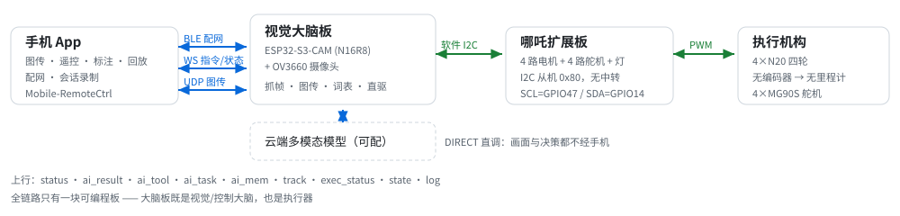

全链路只有一块可编程板：大脑板既是视觉/控制大脑，也是执行器。完整链路说明见 <a href="#2-系统架构">§2 系统架构</a>。

---

## 1. 功能特性

- 📷 **实时图传**：WiFi UDP 推流 JPEG 帧（低延迟、分片自愈），App 内查看画面并框选/标注目标。
- 🎮 **遥控操控**：虚拟摇杆 + 指令面板，小车前进/后退/转向（可切换**原地旋转**式转向）、机械臂升降/移爪/夹爪、三路灯光开关、一键回正。
- 🎯 **指定点移动 / 插话**：`/move to <x> <y> [global]`（词表 `goto`）让板子自行导航到地面坐标；AI 任务进行中输入非空文本即为**插话**（`ai_chat`），补充要求而不打断闭环。
- 🧠 **板载 AI 视觉控制**：手机下发文字/区域目标 → 板子直调云端多模态模型 → 指令 → **直驱落地**（任务级迭代闭环，`ai_goal` / `ai_oneshot`）。板端维护**画面标定（单应）+ 物体空间记忆 + 车姿态累积**，并按需带上上一帧做运动对比。
- ✋ **本地自动夹取（不经 AI）**：在画面上**框选一个目标** → 板端自己用相关滤波跟住它，再闭环完成「降臂 → 旋转对准 → 边前进边对准 → 合爪」（词表 `auto_grasp`）。比"每轮问一次云端"快一个数量级，也是 AI 工具之一。
- 🗺️ **记忆地图 / 轨迹可视化**：App 画面源可切「图传 ↔ 车头系俯视图」，实时看小车记住的物体位置；本地追踪期间板端不推视频，改显标尺网格 + 跟踪十字。
- ⏪ **会话回放**：一次任务从下发到收尾的全过程（聊天/决策/画面/轨迹）按**逻辑时钟**录下来，可在 App 里逐步回看、拖进度、单步前进后退。
- 🧭 **标定网格**：图传可叠加标定网格（`/grid`），配合板端单应标定读屏幕 (u,v) 与实测地面距离取标定点。
- 🦾 **机械臂二连杆 IK**：给末端目标位姿（轴前方 cm + 地面以上 cm），板载反解并联动左右两舵机。
- 📶 **BLE 一次性配网**：App 扫描广播名 `VisionS3` 后写入 WiFi 账号，板子 NVS 存储、在线换网生效（不重启）。
- 🧩 **哪吒协议直驱**：绕过任何执行板，软件 I2C 直接下发舵机 PWM / 电机 PWM / 灯光字节。

## 2. 系统架构

  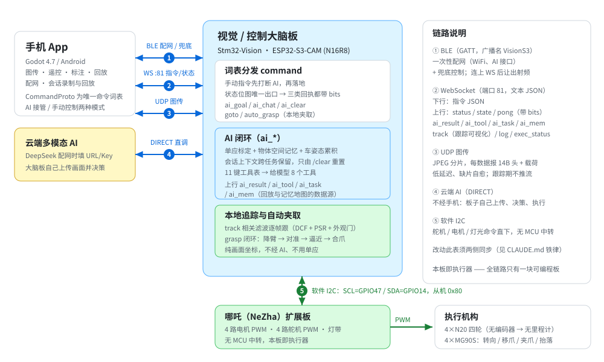

### 两条视觉闭环

板上有**两条并行的视觉链路**，共用同一颗摄像头与同一套执行机构，但决策者不同：

  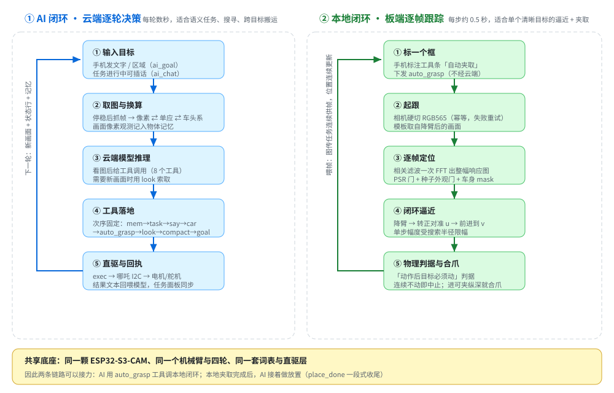

| # | 链路 | 说明 |
|---|---|---|
| ① | BLE | 手机 → 大脑板：一次性配网（WiFi SSID/密码、AI 接口参数）+ 兜底控制。连接后让出 2.4G 射频，断线自动恢复 |
| ② | WiFi WebSocket | 大脑板 ⇄ 手机：指令 JSON 下行 + `status`/`ai_result`/`ai_tool`/`ai_task`/`ai_mem`/`track`/`log`（调试）/`state`（查询回包）上行 |
| ③ | WiFi UDP | 大脑板 → 手机：JPEG 图传分片（每数据报 14B 大端头 + 载荷） |
| ④ | 云端 AI | 大脑板 ⇄ 模型：DIRECT 直调（板子自己上传画面、解析指令、执行闭环） |
| ⑤ | 软件 I2C | 大脑板 → 哪吒板：舵机/电机/灯光命令，**本板即执行器** |

| # | 链路 | 说明 |
|---|---|---|
| ① | BLE | 手机 → 大脑板：一次性配网（WiFi SSID/密码、AI 接口参数）+ 兜底控制。连接后让出 2.4G 射频，断线自动恢复 |
| ② | WiFi WebSocket | 大脑板 ⇄ 手机：指令 JSON 下行 + `status`/`ai_result`/`ai_tool`/`ai_task`/`ai_mem`/`track`/`log`（调试）/`state`（查询回包）上行 |
| ③ | WiFi UDP | 大脑板 → 手机：JPEG 图传分片（每数据报 14B 大端头 + 载荷） |
| ④ | 云端 AI | 大脑板 ⇄ 模型：DIRECT 直调（板子自己上传画面、解析指令、执行闭环） |
| ⑤ | 软件 I2C | 大脑板 → 哪吒板：舵机/电机/灯光命令，**本板即执行器** |

> 词表 JSON（`CommandProto`）只由手机 App 持有；「词表 → 哪吒 I2C 命令」的翻译在大脑板 `command` + `direct_exec` 模块。
>
> 另有一条**不联网的本地闭环**：手机框选 → 词表 `auto_grasp` → 大脑板 `track`（相关滤波逐帧跟）+ `grasp`（自己降臂/对准/前进/合爪）。它与 AI 闭环共用电机/舵机与相机，但**不调云端、也不用单应/全局坐标**，只用画面归一化坐标。

### 软件构成

| 仓库目录 | 角色 | 语言 / 工具链 | 说明 |
|---|---|---|---|
| [`Stm32-Vision/`](Stm32-Vision/CLAUDE.md) | 视觉大脑板 **兼执行器** | C++ · Arduino IDE / arduino-cli（esp32 core 3.3.x） | 摄像头抓帧、WS/UDP 图传、BLE 配网、词表分发、板载 AI、**本地目标追踪与自动夹取**、软件 I2C 直驱 |
| [`Mobile-RemoteCtrl/`](Mobile-RemoteCtrl/CLAUDE.md) | 手机遥控 App | GDScript · Godot 4.7.1 mono（Android） | 三通道通信、虚拟摇杆、图传显示、图片标注与一键自动夹取、记忆地图/追踪可视化、**会话录制与回放**、BLE 配网界面、聊天指令区 |

> ⚠️ **大脑板依赖自编译内核库**（esp32 core 3.3.11，用 esp32-arduino-lib-builder 在 WSL 自编译后覆盖到 Arduino15），共五处定制：
> ① mbedTLS SSL 收发缓冲设 8192B（`CONFIG_MBEDTLS_SSL_IN_CONTENT_LEN` / `CONFIG_MBEDTLS_SSL_OUT_CONTENT_LEN`），否则 AI 直连 TLS 握手因内部堆碎片化失败（-17040/-32512）；
> ② mbedTLS 缓冲改走 PSRAM（`CONFIG_MBEDTLS_EXTERNAL_MEM_ALLOC`），否则内部堆碎片化时 AI 请求报 -3；
> ③ lwIP TCP 缓冲上调（`CONFIG_TCP_SND_BUF_DEFAULT`=32768 / `CONFIG_TCP_WND_DEFAULT`=16384），否则 40KB 级请求体发送 `write()` 超时；
> ④ WiFi TX cache 缓冲加到 32（`CONFIG_ESP_WIFI_CACHE_TX_BUFFER_NUM`），否则图传突发丢帧；
> ⑤ esp32-camera 的 `CONFIG_CAMERA_DMA_BUFFER_SIZE_MAX` 降到 16384 —— 硬切 RGB565 追目标时需要一块 15360 字节的连续内部 DMA，默认 32768（半缓冲 30720）在图传开着时凑不出来，相机会留在 deinit 态。
> 重编流程与定制清单见 [`Stm32-Vision/librebuild/`](Stm32-Vision/librebuild/README.md)。

## 3. 硬件选型（BOM）

整车 = **ESP32-S3-CAM 大脑板** + **淘宝现成的小车/机械臂套件**（驱动板 + 骨架 + 电机 + 舵机 + 电池）。

### 3.1 部件清单

| 分类 | 部件 | 选型 / 规格 | 数量 | 作用与接入 |
|---|---|---|---|---|
| 视觉计算 | 视觉大脑板 | **ESP32-S3-CAM（N16R8）**：ESP32-S3 + 16MB Flash + 8MB PSRAM | 1 | 抓帧/图传/配网/指令分发/板载 AI + **直驱执行器**；`camera.h` 顶部 `CAMERA_MODEL_ESP32S3_EYE` |
| 视觉计算 | 摄像头 | **OV3660**（换装，非板载 OV2640） | 1 | 画面采集；默认倒置与镜像已在 `camera.cpp` init 回正（画面所见即真实方位） |
| 驱动 | 驱动板 | **哪吒（NeZha）扩展板**，I2C 从机地址 `0x80` | 1 | 4 路电机 PWM + 4 路舵机 PWM + 灯带；大脑板软件 I2C 直驱（SCL=GPIO47 / SDA=GPIO14） |
| 执行机构 | 直流减速电机 | **N20 直流电机**（四轮驱动，**无编码器**） | 4 | 哪吒板 Motor1–4；轮位 M1 左后 / M2 右后 / M3 右前 / M4 左前 |
| 执行机构 | 舵机 | **MG90S 模拟舵机**（180°，PWM 50..250） | 4 | 哪吒板 **Servo1=转向**；**Servo2=移爪 / Servo3=夹爪 / Servo4=抬落**（机械臂） |
| 结构 | 车轮 | 套件配套轮 | 4 | 装于四个 N20 电机 |
| 结构 | 车架 + 机械臂 | 套件骨架（小车底盘 + 3 自由度机械臂） | 1 套 | 承载上述部件 |
| 供电 | 电池组 | **12V / 1200mAh** | 1 | 底盘动力与逻辑供电 |
| 连接 | 杜邦线 | 若干 | — | 哪吒板 ↔ 大脑板（I2C）、电机/舵机走线 |
| 紧固 | 螺丝螺帽 | 若干 | — | 结构装配 |

**接线要点（大脑板 ↔ 哪吒扩展板）**

| 信号 | 大脑板 GPIO | 哪吒板 |
|---|---|---|
| 软件 I2C SCL | GPIO47 | SCL |
| 软件 I2C SDA | GPIO14 | SDA |
| 电源 | 5V / GND | 5V / GND |

> ⚠️ **无编码器 ⇒ 无里程计**：直驱固件不做定距/定角闭环，`move` 的 `distance_cm` 与 `spin` 的 `angle_deg` 按**实测标定表的时长近似**到点自停（粗用，供微操/标定）；`arm` 的 `dist_cm` 按「每 cm ≈ 固定拍数」近似。原执行板上的速度 PID、里程计、到位判定随执行板一并裁撤。

### 3.2 舵机 / 电机标定值（固件实测）

| 部件 | 值 |
|---|---|
| 转向 Servo1 | 150 正前 / 120 左死 / 180 右死 |
| 移爪 Servo2 | 中位 200，行程 120..250 |
| 夹爪 Servo3 | 夹紧 50 / 张开 140（中位即张开） |
| 抬落 Servo4 | 中位 180，行程 115..250 |
| 机械臂几何 | 二连杆 L1=L2=7.5cm，肩轴离地 9.5cm，可达半径 4..15cm |
| 灯光 | 前灯 / 氛围灯 / 尾灯（左右一起） |

### 3.3 硬件配图

<!-- ============ 视觉大脑板 ============ -->
**① 视觉大脑板 ESP32-S3-CAM**

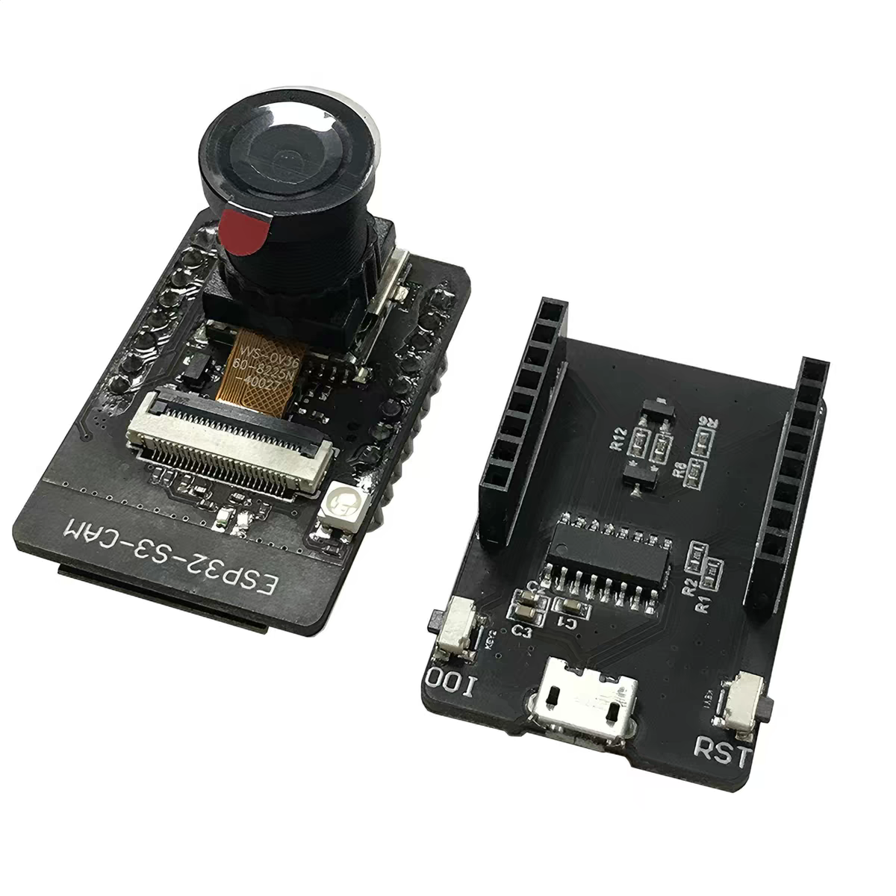

<!-- ============ 套件 ============ -->
**② 小车 / 机械臂套件（驱动板 + 骨架 + 电机 + 舵机）**

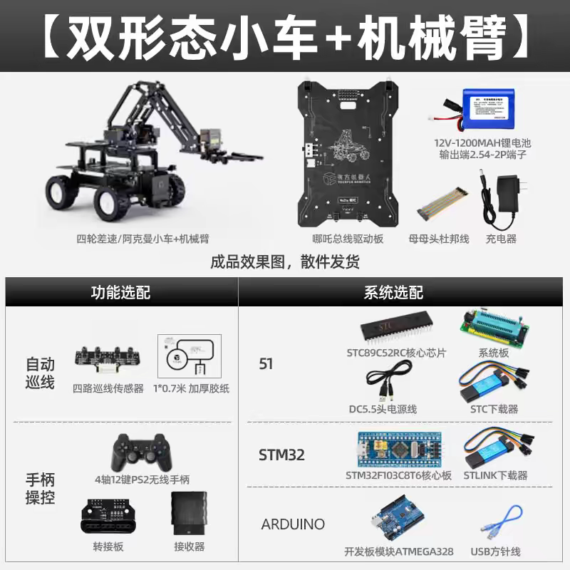

## 4. 成品实拍

**整车正视图**

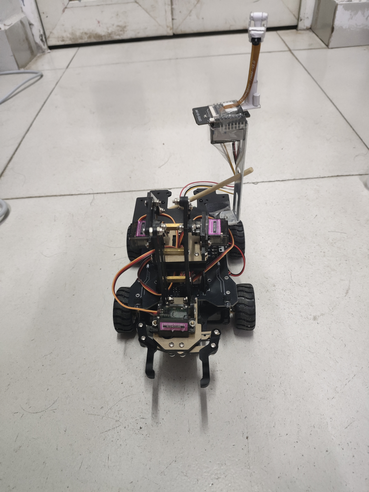

**整车侧视图**

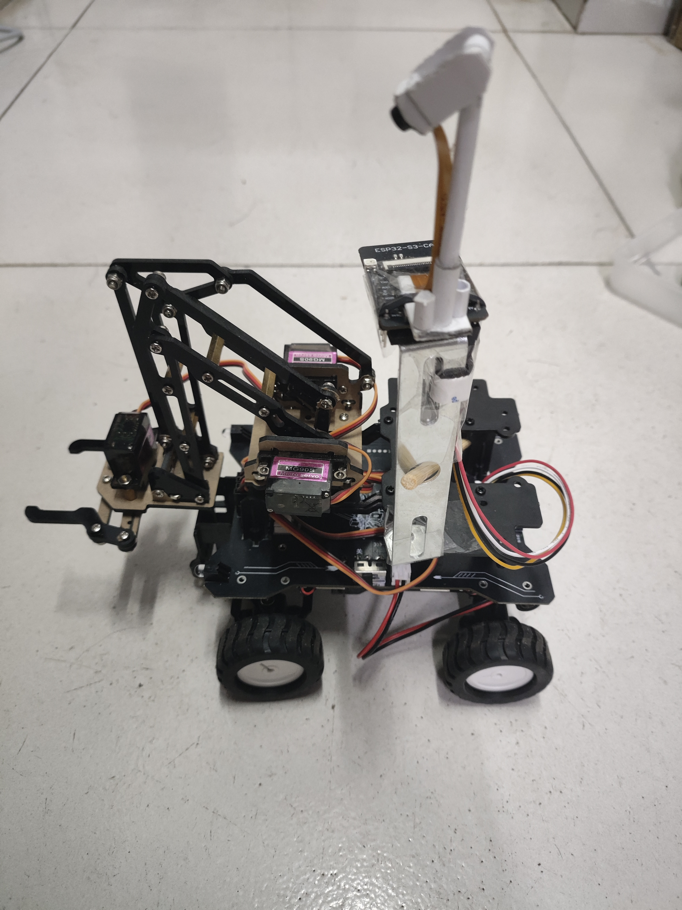

**整车俯视图**

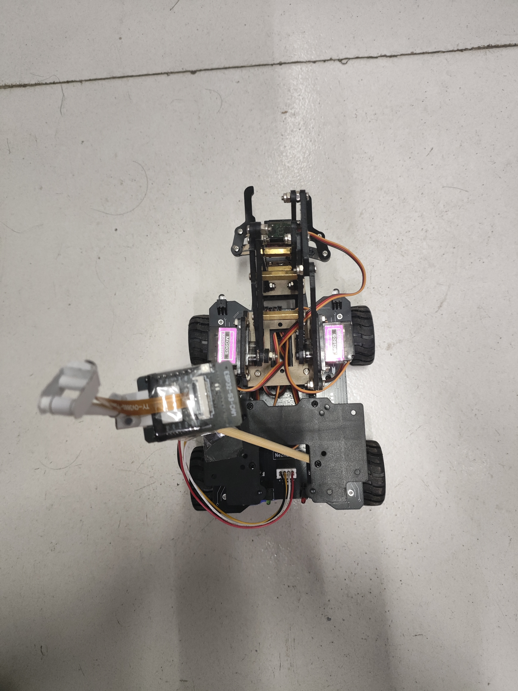

## 5. App 界面

**主控制页**

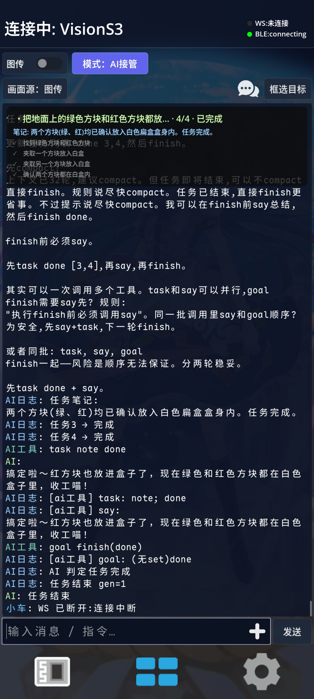

**图片标注**

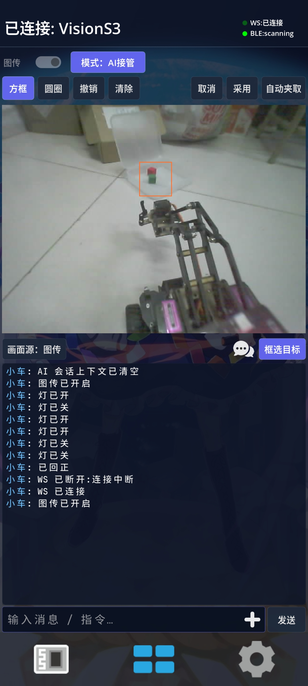

**附加图片**（从系统图库选图 → 压缩 → 可选标注后随 `ai_goal` 上行，最多 3 张）

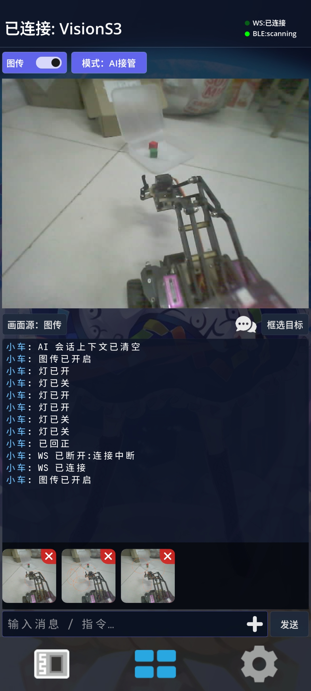

**会话回放**（当前会话 + 归档会话列表，`Session1` 为进行中的那一趟）

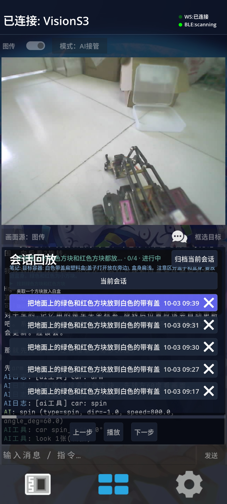

**回放进行中**（底部控制条：上一步 / 播放暂停 / 下一步 + 进度拖动；回放期间输入与下发全部禁用）

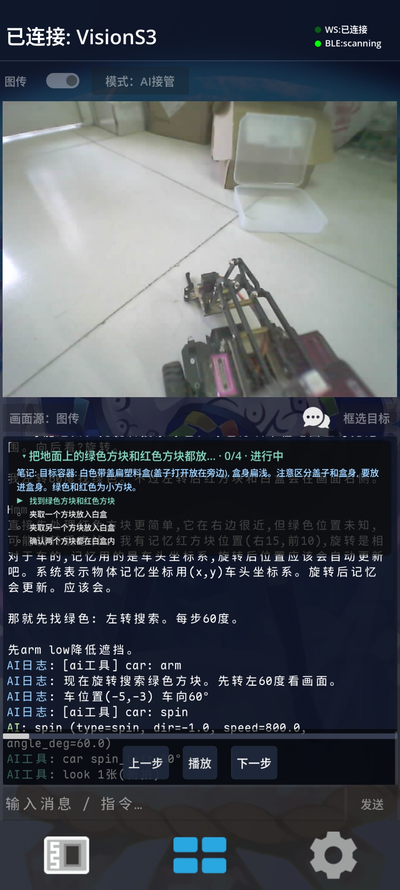

**设备连接配置**（BLE 扫描后确认 WiFi 与云端 AI 接口，模型名从服务端拉列表后下拉选）

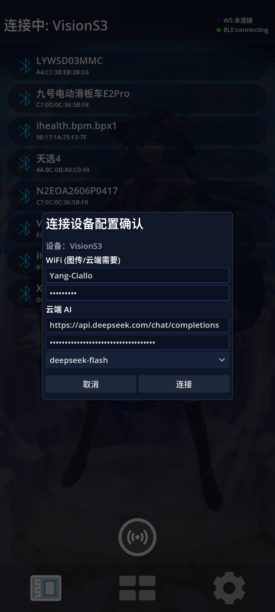

**关于页**

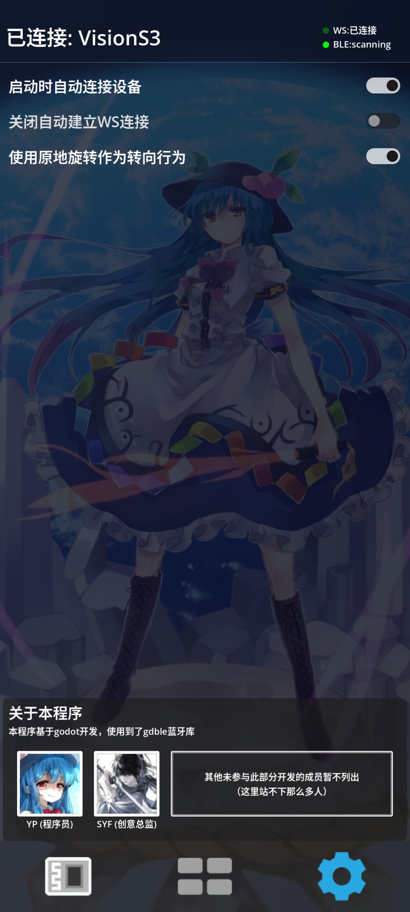

## 6. 演示视频

> GitHub 的 README 会剥掉 `<video>` 标签，附件链接也只按下载处理，所以这里用普通链接（点开即在新标签页播放）。

- **[AI 夹取任务演示](https://github.com/user-attachments/assets/b705907e-5b11-46ff-b3a7-8009f90ea83e)** —— 云端多模态模型逐轮决策 → 词表指令 → 直驱落地（横屏，约 3 分钟）
- **[手动控制演示](https://github.com/user-attachments/assets/030118ea-cccd-4614-9c40-c62b92951e69)** —— 摇杆驱车、机械臂与灯光直控（竖屏手机录制，约 43 秒）

## 7. 部署与校准（装机后按实际重校）

固件内置的是**默认出厂实测值**；换镜头、移相机、换电机/舵机、改底盘后，以下几处**手动校准**需要重做。所有校准数据集中在 `Stm32-Vision/Calibration.h`（`Calibration.cpp` 提供机械臂散点接入），**改完重新编译烧录即生效**（数据只进 flash、不占运行内存），无需动其它源文件。

| 校准项 | 为什么需要手动校准 | 在哪改（`Calibration.h`） |
|---|---|---|
| **画面坐标 ↔ 实际坐标映射** | 屏幕归一化像素 (u,v) 与车头系地面厘米依靠实测标定点拟合**单应**；相机角度/高度或换镜头都会变，标定不准会让 AI 的像素观测失真 | `kGroundCal`：每行 `{u, v, x右, y前}`，≥4 点、尽量覆盖整个屏幕 |
| **机械臂移动** | 机械臂夹心目标位姿(x,h) ⇄ 移爪/抬落两舵机 PWM 是**非线性**映射，靠实测散点做 IDW 插值；舵机压力/装配都会影响，错位或末端对不上要重测 | `kArmPts`：每点 `{移爪PWM, 抬落PWM, x车前, h离地}`；连续动作步长与定距在 `ARM_STEP_CM`、`ARM_CNT_PER_CM` |
| **小车定距前进** | 电机**无编码器**，`move distance_cm` 只能按**时长近似**，需按油门实测车速与起停余量 | `MV_SPEED_X/Y`、`MV_COAST_X/Y`（按油门插值表） |
| **小车定角原地转向** | 同理，`spin angle_deg` 按时长近似，需按转速实测毫秒/度 | `SPIN_TBL_DEG/MS`（查表插值）、必要时调整 `SPIN_MIN_SPEED` |
| **本地追踪与自动夹取** | 闭环靠"目标在画面上挪多少"驱动，而画面挪多少取决于**相机装姿、底盘、目标实际尺寸**；换硬件或改车后这套判据要重新标 | `GRASP_*`（对准目标点 u/v 与随距离收紧的容差、最小/最大转角、每 cm 前进的横向漂移预算、卡死判据的期望位移比例）与 `TRACK_*`（种子框尺寸、PSR 门、搜索半径相关项）。⚠️ 这些值的注释里记着"为什么是这个数"的真机实测，**先读再改** |

> 🔧 **校准提示**
> - 舵机限位/回中也在此文件：`STEER/REACH/GRIP/LIFT_*_CENTER/_LO/_HI`，首次装机或换舵机后按实际行程复核。
> - **画面标定点**：App 图传开 `/grid` 叠加网格，读网格交点屏幕坐标 (u,v)，再用直尺/米测出对应地面 (x,y) 填入 `kGroundCal`。
> - **机械臂标定点**：把臂摆到若干到位姿，记录两个舵机 PWM 与实测夹心 (x 车前、h 离地) 填入 `kArmPts`。
> - **定距/定角**：让车前进设定距离、原地旋转设定角度，实测实际位移/转角，按油门/转速填 `MV_*` / `SPIN_TBL_*` 表。
> - 上表均有默认值可直接跑；仅当某处行为不对或硬件变更时才需重校。

## 8. 上手流程

1. **烧录大脑板** → 上电后板子广播 BLE `VisionS3`。
2. **App 配网**：连接该广播，写入 WiFi 账号密码与 AI 接口参数（URL/Key/模型，模型名从服务端拉列表后下拉选）。
3. **连上 WiFi**：App 经 WebSocket（端口 81）取得指令/状态通道，按需开启图传（UDP）。
4. **遥控**：摇杆驱车（可在「关于」页切换为原地旋转式转向）、按钮控机械臂/灯光；或在聊天区直接输入文字下发 AI 目标。
5. **本地夹取**：切到「AI 接管」模式 → 点标注按钮框住目标 → 「自动夹取」。板端会自己跟住目标并完成整套夹取动作，App 上能看到跟踪十字与板端每一步的回执。
6. **调试**：`/log exec on` 看板端状态推送与执行日志、`/log ai on` 看 AI 时序日志、`/log all on` 转发板端全部串口输出（聊天区内容统一落盘 `user://logs/app.log`）、`/grid on` 叠加图传标定网格。
7. **回放**：一次任务做完（或随时 `/clear` 归档）后，从「AI 接管」栏的会话按钮打开列表，可逐步回看整趟过程。回放是只读的，其间不能下发任何指令。

---

*主要面向本人维护迭代的工程文档；各子目录由各自仓库独立演进，本仓库为统一收纳视图。*
